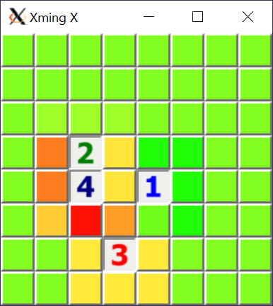

# Minesweeper Probabilities

A minimal GUI based on Minegauler that allows straightforward creation of board situations and displays the safety of the cells using a green-yellow-red colour scale.

Runs with Python3.7+.
